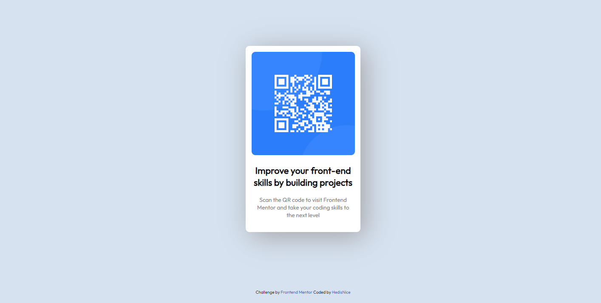

# Frontend Mentor - QR code component solution

This is a solution to the [QR code component challenge on Frontend Mentor](https://www.frontendmentor.io/challenges/qr-code-component-iux_sIO_H). Frontend Mentor challenges help you improve your coding skills by building realistic projects.

## Table of contents

- [Overview](#overview)
  - [Screenshot](#screenshot)
  - [Links](#links)
- [My process](#my-process)
  - [Built with](#built-with)
  - [What I learned](#what-i-learned)
  - [Continued development](#continued-development)
- [Author](#author)

**Note: Delete this note and update the table of contents based on what sections you keep.**

## Overview

### Screenshot



### Links

- Solution URL: [https://github.com/hedisnice/QR-Code-Challenge]
- Live Site URL: [https://hedisnice.github.io/QR-Code-Challenge/]

## My process

After some basic chapters of HTML & CSS Fundamentals of Full Stacks Engineer Course from Codecademy this was an attempt to test my knowledge. Used only basic Sematic HTML and basic CSS.

### Built with

- Semantic HTML5 markup
- CSS custom properties

### What I learned

Use this section to recap over some of your major learnings while working through this project. Writing these out and providing code samples of areas you want to highlight is a great way to reinforce your own knowledge.

In this project, I was able to put it into practice Sematic HTML and CSS. Learned how to adjust an image into a container.

```css
img {
  width: 100%;
  height: auto;
  border-radius: 10px;
}
```

Learned how to center a div with marging, managed to understand to use the auto in margin i need to give some width to the container first.

```css
.white-container {
  width: 300px;
  margin: 150px auto;
  background-color: hsl(0, 0%, 100%);
  border-radius: 10px;
  box-shadow: 12px 12px 70px #a5a5a5;
}
```

And finally learned about padding to have some space between the image and the white container.

```css
.content-container {
  padding: 15px;
  text-align: center;
}
```

### Continued development

Being my first challenge after learning the basics of HTML and CSS, I feel that the best way to learn is to practice and do more challenges. So every time I finish another chapter of the course I'll proceed with a new challenge.

## Author

- Facebook - [Wachiraphong Pa-ai](https://www.facebook.com/hedisgeneral/)
- Instagram - [nightripperr](https://www.instagram.com/nightripperr/)

```

```
